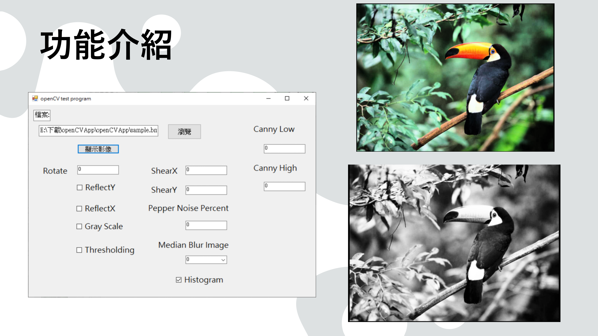
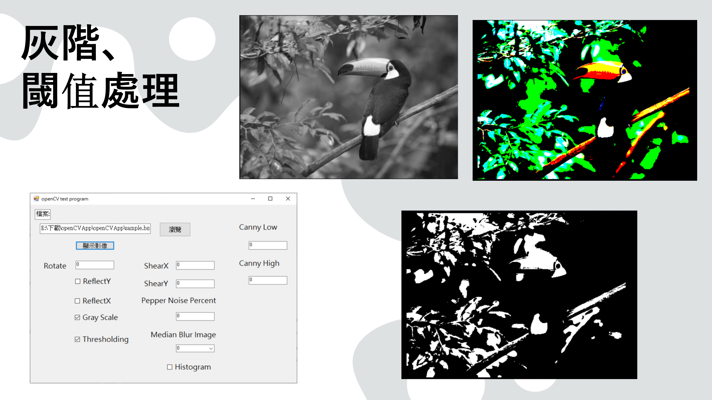
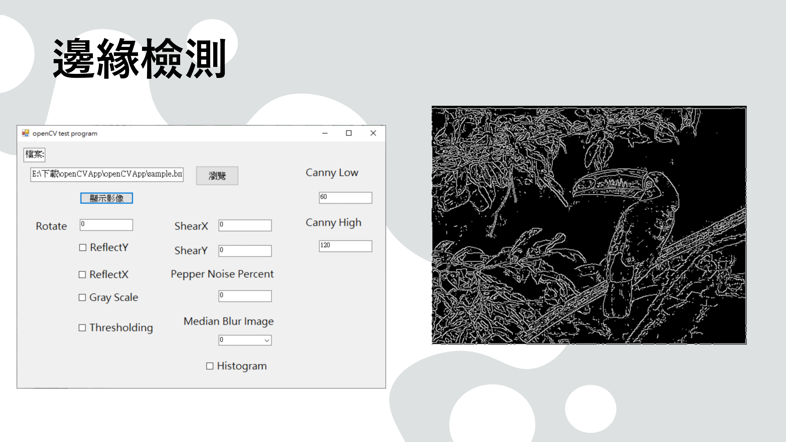

# 影像處理課堂專案 - Windows 影像處理工具 (C# WinForms + C++ OpenCV)

本專案為影像處理課程實作作品，將課堂上學到的影像處理方法整合成一套可操作的 Windows 應用程式。  
系統以 C# Windows Forms 製作操作介面，並使用 C++ 搭配 OpenCV 實作影像處理核心，支援參數調整與即時顯示處理結果。

---

## 📌 背景
隨著數位影像技術的發展，影像處理已經成為了許多領域中不可或缺的工具，無論是醫學影像分析、機器視覺、智能監控還是虛擬現實等，都離不開高效且精確的影像處理技術。  
影像處理技術不僅能夠提升影像的質量，還能從中提取有用的信息，並轉化為對決策有價值的資料。

---

## 🎯 動機
在影像處理課程學習的過程中，我希望能把課堂所學的影像處理方法，整理成一個可實際操作的工具。  
因此本研究以 Windows 環境為目標，將多項常見影像處理功能整合進同一套系統中，透過操作介面即時呈現處理結果，讓影像處理的流程與效果差異更加直觀。

---

## 🛠 開發工具與程式語言
- Visual Studio
- C#
- C++
- OpenCV
- Windows Forms

---

## ⚙️ 功能
本系統整合多項常見影像處理功能，包含：

- 旋轉 (Rotate)
- 鏡射 X、鏡射 Y (ReflectX / ReflectY)
- 灰階轉換、閾值處理 (Gray Scale / Thresholding)
- 水平簡形、垂直簡形
- 胡椒噪聲、中值模糊 (Pepper Noise / Median Blur)
- 邊緣檢測 (Edge Detection)

---

## 🖼 成果展示

### 功能總覽

### 旋轉

### 鏡射 X、鏡射 Y

### 灰階、閾值處理

### 水平簡形、垂直簡形

### 胡椒噪聲、中值模糊

### 邊緣檢測

---

## ✅ 結論
在本研究過程中，我深入了解如何將 C# 的 Windows Forms 應用程式與 C++ 的 OpenCV 庫相結合，並學習了如何利用 OpenCV 進行高效的影像處理。  
通過這一過程，我不僅掌握了影像處理的基本概念和方法，還了解了如何將 C++ 影像處理功能與 C# 的介面結合，以便在 Windows 環境中進行開發，並累積了跨語言整合與應用開發的實務經驗。

